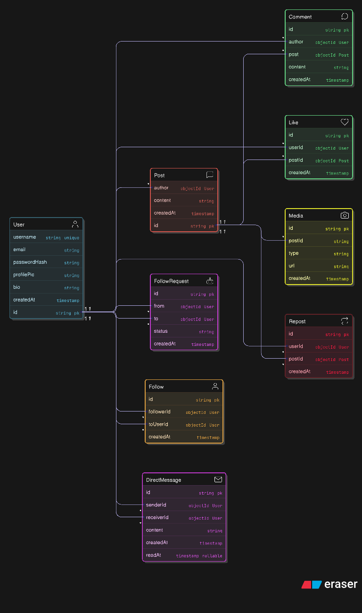

# Social Media Backend Data Models

This repository defines the backend data models for a social media platform, supporting user profiles, content posting, interactions, and relationships. It is designed for a NoSQL database like MongoDB, using string primary keys and ObjectID references for entity relationships.

## Key Entities

### User
- **Fields:** `username` (unique), `email`, `passwordHash`, `profilePic`, `bio`, `createdAt`
- **Relationships:**
  - Links to posts, comments, likes, reposts, follows, and follow requests

### Post
- **Fields:** `author` (User reference), `content`, `createdAt`
- **Relationships:**
  - Associated with comments, likes, media, and reposts

### Comment
- **Fields:** `author` (User reference), `post` (Post reference), `content`, `createdAt`

### Like
- **Fields:** `user` (User reference), `post` (Post reference), `createdAt`

### Media
- **Fields:** `post` (Post reference), `type` (e.g., image/video), `url`, `createdAt`

### FollowRequest
- **Fields:** `fromUser` (User reference), `toUser` (User reference), `status` (pending/accepted/rejected), `createdAt`

### Repost
- **Fields:** `user` (User reference), `originalPost` (Post reference), `createdAt`

### Follow
- **Fields:** `follower` (User reference), `followed` (User reference), `createdAt`

## Relationships

- **One-to-many:**
  - Users author multiple posts, comments, likes, and reposts
  - Posts have multiple comments, likes, and media

- **Many-to-many:**
  - Follows and follow requests between users
